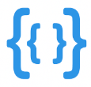
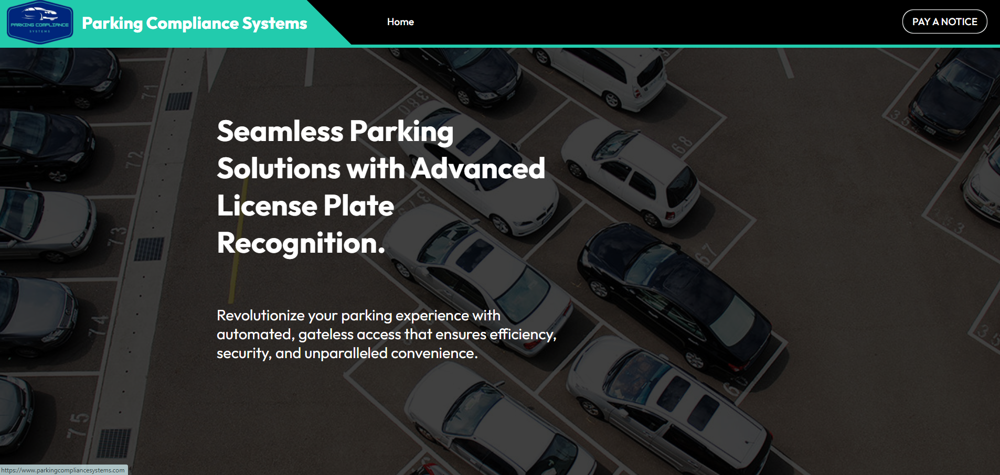
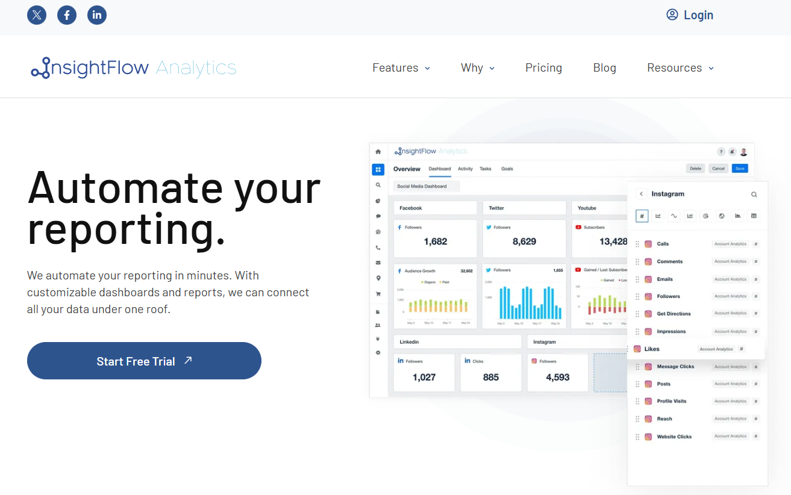

  <h2>💦 Senior Full-Stack Developer | AI, SaaS, React, Node/Python 💦</h2>

<h4>I’m a Full-Stack Developer specializing in AI-driven SaaS products, with experience building reliable, user-focused platforms from end to end. I enjoy working on projects where technology solves real problems for real people, and I focus on keeping my solutions simple, scalable, and effective.</h4>

<h4>On the backend, I build secure and maintainable APIs, integrate AI features, and design architectures that can handle growth without slowing down. On the frontend, I create clean, responsive interfaces that feel fast and intuitive, using modern frameworks and best practices to improve user experience.</h4>

<h4>I’m comfortable working across the full product lifecycle — planning, development, testing, deployment, and ongoing improvement. I collaborate closely with teams, communicate clearly with non-technical stakeholders, and always aim to deliver high-quality results on time.</h4>

 

# 
<table align="center">
<!-- skill -->
  <tr>
    <td align="center" width="90">
      
       TypeScript
    </td>
    <td align="center" width="90">
      
       JavaScript
    </td>
    <td align="center" width="90">
      
       Python
    </td>
    <td align="center" width="90">
      
       PHP
    </td>
    <td align="center" width="90">
      
       C++
    </td>
    <td align="center" width="90">
      
       HTML5
    </td>
    <td align="center" width="90">
      
       CSS
    </td>
    <td align="center" width="90">
      
       SQL
    </td>
    <td align="center" width="90">
      
       Shell script
    </td>
    <td align="center" width="90">
      
       JSON
    </td>
  </tr>
  <!-- network row removed as requested -->
<tr>
    <td align="center" width="90">
      
       Nodejs
    </td>
    <td align="center" width="90">
      
       Express
    </td>
    <td align="center" width="90">
      
       React
    </td>
    <td align="center" width="90">
      
       Next.js
    </td>
    <td align="center" width="90">
      
       Django
    </td>
    <td align="center" width="90">
      
       FastAPI
    </td>
    <td align="center" width="90">
      
       Laravel
    </td>
    <td align="center" width="90">
      
       PostgreSQL
    </td>
    <td align="center" width="90">
      
       MongoDB
    </td>
    <td align="center" width="90">
      
       MySQL
    </td>
  </tr>
<!-- common -->
  <tr>
    <td align="center" width="90">
      
       Tailwind CSS
    </td>
    <td align="center" width="90">
      
       Material-UI
    </td>
    <td align="center" width="90">
      
       Ant Design
    </td>
    <td align="center" width="90">
      
       Redux
    </td>
    <td align="center" width="90">
      
       Bootstrap
    </td>
    <td align="center" width="90">
      
       OpenAI
    </td>
    <td align="center" width="90">
      
       DeepSeek
    </td>
    <td align="center" width="90">
      
       LangChain
    </td>
    <td align="center" width="90">
      
       TensorFlow
    </td>
    <td align="center" width="90">
      
       PyTorch
    </td>
  </tr>
  <tr>
    <td align="center" width="90">
      
       Flask
    </td>
    <td align="center" width="90">
      
       Celery
    </td>
    <td align="center" width="90">
      
       GraphQL
    </td>
    <td align="center" width="90">
      
       OAuth2
    </td>
    <td align="center" width="90">
      
       JWT
    </td>
    <td align="center" width="90">
      
       AWS
    </td>
    <td align="center" width="90">
      
       Google Cloud
    </td>
    <td align="center" width="90">
      
       Docker
    </td>
    <td align="center" width="90">
      
       Nginx
    </td>
    <td align="center" width="90">
      
       Kubernetes
    </td>
  </tr>
  <tr>
    <td align="center" width="90">
      
       Azure
    </td>
    <td align="center" width="90">
      
       RabbitMQ
    </td>
    <td align="center" width="90">
      
       Git
    </td>
    <td align="center" width="90">
      
       Jenkins
    </td>
    <td align="center" width="90">
      
       GitHub Actions
    </td>
    <td align="center" width="90">
      
       Postman
    </td>
    <td align="center" width="90">
      
       Jest
    </td>
    <td align="center" width="90">
      
       Mocha
      </td>
    <td align="center" width="90">
      
       Jira
    </td>
    <td align="center" width="90">
      
       Scrum
    </td>
  </tr>
  
</table>
 

# <i>My Previous Projects</i>

I have built and delivered multiple full-stack projects, including an AI-based B2B Smart Parking SaaS platform featuring real-time vehicle recognition, automated monitoring, admin dashboards, and scalable backend services. My work spans end-to-end development across FastAPI, Python, Node.js, React, PostgreSQL, AWS, Docker, and CI/CD pipelines, covering features like API integrations, data processing workflows, role-based dashboards, secure authentication (OAuth2/JWT), and performance-optimized UIs. I have also developed internal tools, booking systems, AI-powered automations, and high-traffic web applications, maintaining clean architecture, reliability, and production-ready code throughout all projects.

<h3><u><strong><a href="https://www.parkingcompliancesystems.com/" target="_blank">Parking Compliance Systems</a></strong></u></h3>

I have built and delivered multiple full-stack projects, including an AI-based B2B SaaS platform for smart parking at ParkingComplianceSystems.com — a system designed to help parking operators automate vehicle recognition, real-time occupancy tracking, and automated billing & enforcement. I developed the backend services, integration with AI and sensor data, and the web dashboard for admins and operators, using technologies like Python, FastAPI, PostgreSQL, React, Docker, and AWS. I have also built internal tools, booking and reservation systems, and high-traffic web applications always ensuring scalable architecture, maintainable code, secure authentication (OAuth2/JWT), and responsive user interfaces.

<h3><u><strong><a >InsightFlow</a></strong></u></h3>

InsightFlow is an AI-driven B2B analytics platform designed to help small and mid-sized companies turn raw business data into real-time insights, forecasts, and automated reports. I developed the platform’s full-stack architecture, including the data ingestion pipeline, backend APIs, authentication workflow (OAuth2/JWT), and the admin dashboard. I integrated AI models to generate automated insights, anomaly detection alerts, customer behavior predictions, and natural-language summaries for weekly reports. On the frontend, I built interactive dashboards using React, React Query, and Tailwind CSS, with data visualizations powered by Recharts. The platform was deployed on AWS using Docker, CI/CD pipelines, and scalable PostgreSQL instances. InsightFlow helped clients reduce manual reporting time by 70% and improved decision-making with AI-generated insights.

     

